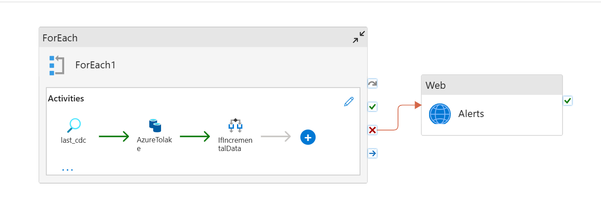
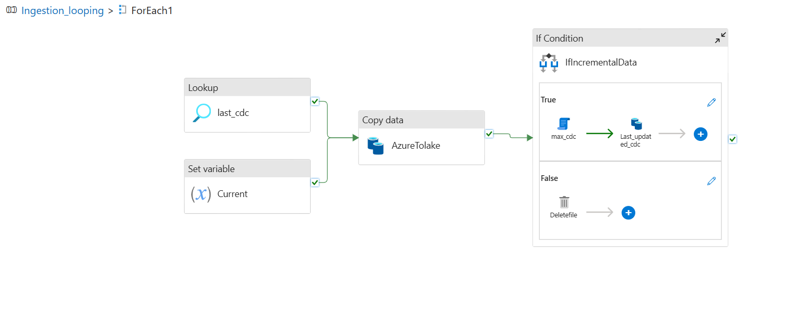

# 🚀 Azure Data Engineering Project  
**End-to-End Data Pipeline using Azure Data Factory & Databricks**

---

## 📌 Project Overview

In this project, I built a **complete end-to-end Azure Data Engineering pipeline** using **Azure Data Factory (ADF)** and **Azure Databricks**, following the **Medallion Architecture (Bronze → Silver → Gold)**.

The objective of this project is to:
- Ingest data from a **SQL Server source**
- Process and transform data across multiple layers
- Generate **clean, curated, business-ready datasets**

The pipeline is designed using **dynamic and metadata-driven approaches**, reducing manual effort and making the solution scalable and reusable.

---

## 🏗️ Architecture Overview (Medallion Architecture)

**Bronze → Silver → Gold**

- **Source**: SQL Server (connected to ADF)
- **Bronze Layer**: Raw data ingestion
- **Silver Layer**: Cleaned and standardized data
- **Gold Layer**: Curated, analytics-ready data
- **Orchestration**: Azure Data Factory (ADF)
- **Transformation**: Azure Databricks

---

## 🔧 Tech Stack

- **Azure Data Factory (ADF)**
- **Azure Databricks**
- **SQL Server**
- **PySpark**
- **Python**
- **Delta Live Tables (DLT)**
- **Jinja Templates**
- **Databricks Asset Bundles**

---

## 🥉 Bronze Layer – Data Ingestion (ADF)

The **Bronze layer** focuses on **raw data ingestion** from SQL Server using **Azure Data Factory**.

### Key Highlights

- Built a **dynamic ADF pipeline**
- Used **ForEach activity** to loop through a **metadata-driven schema**
- Avoided manual configuration of:
  - Table names
  - Schemas
  - Columns
- Enables ingestion of **multiple tables automatically**

### Incremental Loading & Backfilling

- Implemented **incremental data loading**
- Ensures only **new or changed data** is ingested
- Improves performance and reduces unnecessary processing
- Implemented **Backfilling** to re-ingest historical data when required, ensuring data accuracy & data completeness.

### Monitoring & Alerts

- Configured **ADF pipeline failure alerts**
- Email notification is triggered whenever a pipeline fails
- Helps in the quick identification and resolution of issues

## Azure Data Factory - Pipeline

---

## 🥈 Silver Layer – Data Cleaning & Standardization

The **Silver layer** is responsible for transforming raw Bronze data into a **clean and structured format**.

### Key Transformations

- Applied data cleansing and standardization logic
- Converted raw data into **structured Delta format**
- Implemented reusable **Python utility functions** for transformations

### Streaming with Auto Loader

- Used **Databricks Auto Loader** for streaming-based ingestion
- Automatically detects and processes **new incoming data**
- Handles schema evolution efficiently
- Supports scalable, incremental data processing

### Asset Bundles

- Used **Databricks Asset Bundles** to manage:
  - Silver layer transformations
  - Gold layer transformations
- Keeps transformation logic organized and deployable

Data is written to:
- **Delta tables**
- **Blob storage**

---

## 🥇 Gold Layer – Business-Ready Data

The **Gold layer** provides **curated datasets** ready for analytics and reporting.

### Metadata-Driven Design

- Implemented **Jinja templates**
- Transformation logic is **metadata-driven**
- Eliminates hardcoding and manual SQL rewriting
- Easy to extend for new tables or business rules

### Delta Live Tables (DLT)

- Used **Delta Live Tables**
- Handles **Slowly Changing Dimensions (SCD)**
- Ensures data consistency and reliability
- Simplifies pipeline management and dependency handling

Final Gold datasets are:
- Optimized
- Clean
- Ready for BI and analytics use cases

## DLT - Pipeline

---

